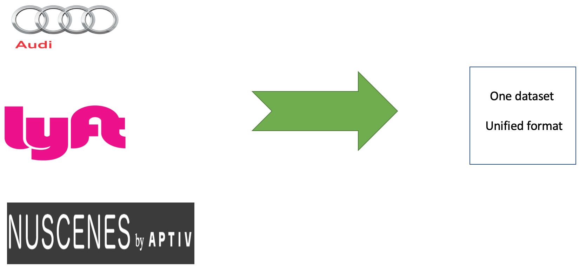
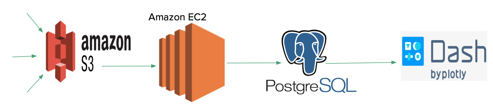

## Auto cArchive 
A unified data warehouse for autonomous cars 

## Multiple autonomous driving datasets, one data format

Autonomous driving research is a trending topic right now, large tech corporations are starting to catch up on the field. In 2019, many companies started releasing open datasets for autonomous driving, asking the research community to contribute in developing the vehicles.

Each one of the released datasets shows a set of driving situations in a specific city. Researchers and engineers who are interested in this kind of data want to study the generalization of their computer vision algorithms across different locations and weather conditions. That would allow them to develop methods that enable safe driving in urban areas. 

Autonomous driving companies chose different data formats for their released datasets which complicates the process of testing computer vision algorithms across different datasets.  

This repository combines data from three autonomous driving datasets in different formats into a standard, unified format, in order to support the development of better machine learning pipelines or computer vision algorithms.

The main objective is to facilitate a common computer vision task which is object detection. The unified data includes links to locations of images in an Amazon S3 bucket. For each image there is a classification for the object detected in it, along with other information pertaining to the object like size, orientation and distance.

The unified dataset allows the testing of computer vision algorithms against images from different driving environments like Singapore, Boston, Palo Alto and Germany. For example, it can be used to test if a computer vision algorithm would be able to recognize traffic signs in images from different cities where the design of the signs is different.

## Pipeline
The pipeline used to create a unified data warehouse for autonomous driving is shown in the figure below. First, the three datasets were ingested into an Amazon S3 bucket. A python script running on an Amazon EC2 instance reads the data from the bucket and transforms it to the unifies format. The output is stored in a Postgres database running on another Ec2 instance. Finally, a web dashboard was designed and integrated to allow the users to run queries against the database. 

